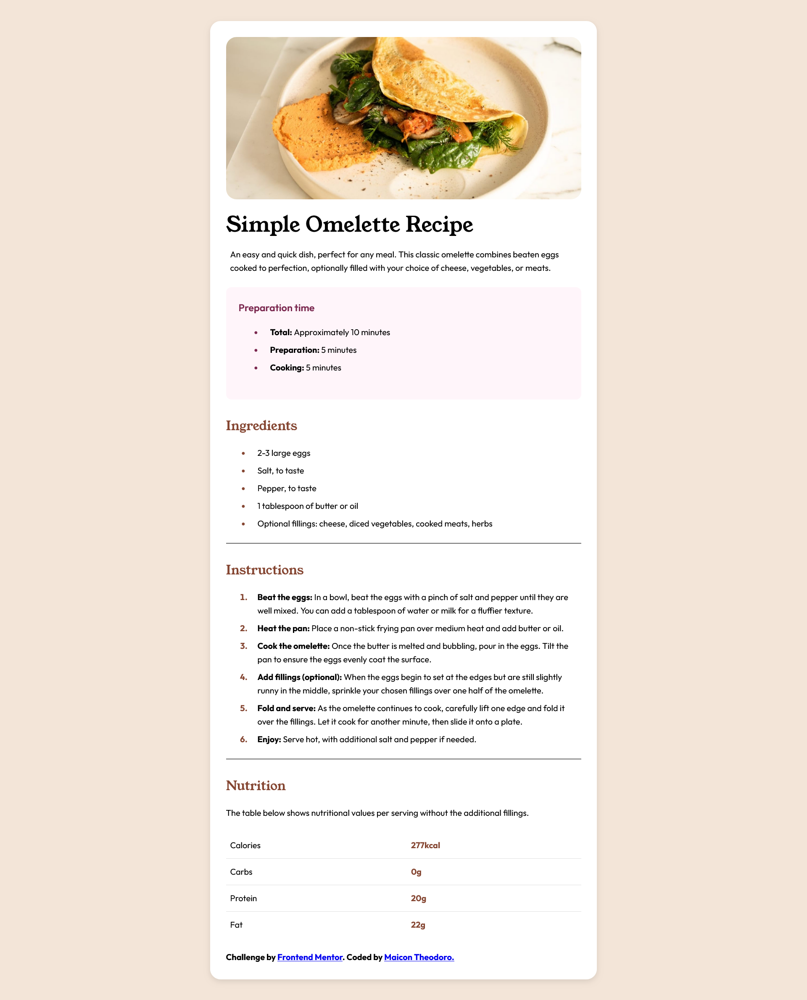
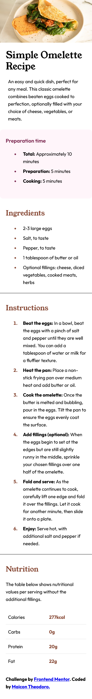

# Frontend Mentor - Recipe Page Solution

This is a solution to the [Recipe page challenge on Frontend Mentor](https://www.frontendmentor.io/challenges/recipe-page-KiTsR8QQKm). Frontend Mentor challenges help you improve your coding skills by building realistic projects.

## Table of Contents

- [Overview](#overview)
  - [The Challenge](#the-challenge)
  - [Screenshot](#screenshot)
  - [Links](#links)
- [My Process](#my-process)
  - [Built with](#built-with)
  - [What I learned](#what-i-learned)
  - [Continued Development](#continued-development)
  - [Useful Resources](#useful-resources)
- [Author](#author)
- [Acknowledgments](#acknowledgments)

## Overview

### The Challenge

The challenge was to build a responsive recipe page that closely matches the provided design. The main goal was to replicate the page structure, including the main image, preparation information, lists of ingredients and instructions, and a nutrition table.

### Screenshot

 

### Links

- Solution URL: [Add your solution URL here](https://www.frontendmentor.io/solutions/your-solution-url-here) its gonna updated the most soon possible.
- Live Site URL: [(https://maiconvts.github.io/recipe-page/)

## My Process

### Built with

- Semantic HTML5 markup
- CSS Custom Properties (Variables)
- Flexbox (for centering and some alignments)
- Responsive Design (with Media Queries for mobile adaptation)
- Local Fonts with `@font-face`

### What I learned

During this project, I reinforced my knowledge and learned more about:

- **CSS Custom Properties (Variables):** I learned how to effectively use CSS Custom Properties to manage reusable values such as colors, font families, and font weights. This made the stylesheet more maintainable and easier to update consistently.
    ```css
    :root {
      --font-family-sans-serif: "Outfit", sans-serif;
      --fw-bold: 700;
      --color-nutmeg: hsl(14, 45%, 36%); 
    }

    body {
      font-family: var(--font-family-sans-serif);
    }

    .section-title {
      color: var(--color-nutmeg);
      font-weight: var(--fw-bold);
    }
    ```

- **`@font-face` for Local Fonts:** I gained experience in loading local font files (like `.ttf` or variable fonts) directly into the project using the `@font-face` rule. This involved specifying the `font-family` name for use in CSS, providing the `src` path to the font file(s) with `url()` and `format()`, and defining `font-weight` and `font-style` for each font variation.
    ```css
    @font-face {
      font-family: 'Outfit';
      src: url('./assets/fonts/outfit/Outfit-VariableFont_wght.ttf') format('truetype-variations');
      font-weight: 100 900; 
      font-style: normal;
    }
    ```

- **Table Styling:** I practiced styling HTML tables to enhance readability and visual structure, specifically focusing on the nutrition information table. This included using `border-collapse`, applying `padding` to table cells (`td`), managing text alignment, and styling specific rows or cells, such as adding bottom borders to rows and giving distinct styles to nutrient values.
    ```css
    .nutrition-table {
      width: 100%;
      border-collapse: collapse; /* Ensures clean borders */
    }

    .nutrition-table td {
      padding: 0.75em 0.5em; /* Spacing within cells */
    }
    ```

- **Responsive Design with `@media` Queries:** I increased my familiarity with using `@media` queries to adapt the layout and styles for different screen sizes. This was crucial for creating a distinct mobile view (e.g., for screens up to 600px wide) that matched the design requirements, such as adjusting paddings, font sizes, and making images full-width.
    ```css
    @media (max-width: 600px) {
      /* Mobile-specific styles */
      .main-content {
        padding: 0;
      }
      .main-content img {
        border-radius: 0;
      }
    }
    ```

### Continued Development

For future projects, I plan to focus on:

- Deepening my understanding of responsive design, perhaps by strictly following a mobile-first approach.
- Practicing more with CSS Grid for more complex page layouts.
- Improving the accessibility (WCAG) of my web pages.
- Starting to integrate JavaScript to add interactivity to projects.

### Useful Resources

- [MDN Web Docs](https://developer.mozilla.org/) - Always an incredible reference for HTML, CSS, and JavaScript. I frequently consulted it for details on `@font-face`, Flexbox, and Media Queries.
- [W3Schools](https://www.w3schools.com) - A valuable resource for straightforward tutorials, practical examples.
- [Google Fonts](https://fonts.google.com/) - Although I used local fonts, this was a helpful resource for initially previewing and selecting the "Young Serif" and "Outfit" fonts.
- *(Add any other links, guides, ou tools that helped you here!)*

## Author

- Maicon Theodoro
- Frontend Mentor - [@MaiconVts](https://www.frontendmentor.io/profile/MaiconVts)
- GitHub - [@MaiconVts](https://github.com/MaiconVts)
- LinkedIn - [Maicontheodoro)](https://www.linkedin.com/in/maicontheodoro/)

## Acknowledgments

I'd like to thank the Frontend Mentor community for this challenge and the learning opportunity.
*(If anyone else helped you, mention them here! If you completed this challenge by yourself, you can remove this section or just thank the platform.)*
